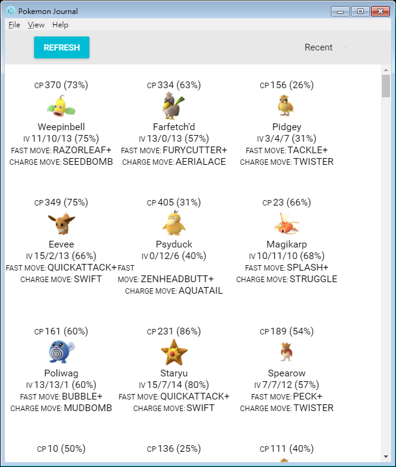

# Pokemon Journal
View your pokemon and their individual values. Base ob billyvg's work and add fast and charge move for each pokemon. 

**Use at your own risk, you can get banned!**

## Prerequisites
- [Git](https://git-scm.com/book/en/v1/Getting-Started-Installing-Git)
- [Node.js](https://nodejs.org/en/download/package-manager/)

## Screenshot

#### Development
Install first before run

`npm install`

Run server

`npm run dev`
